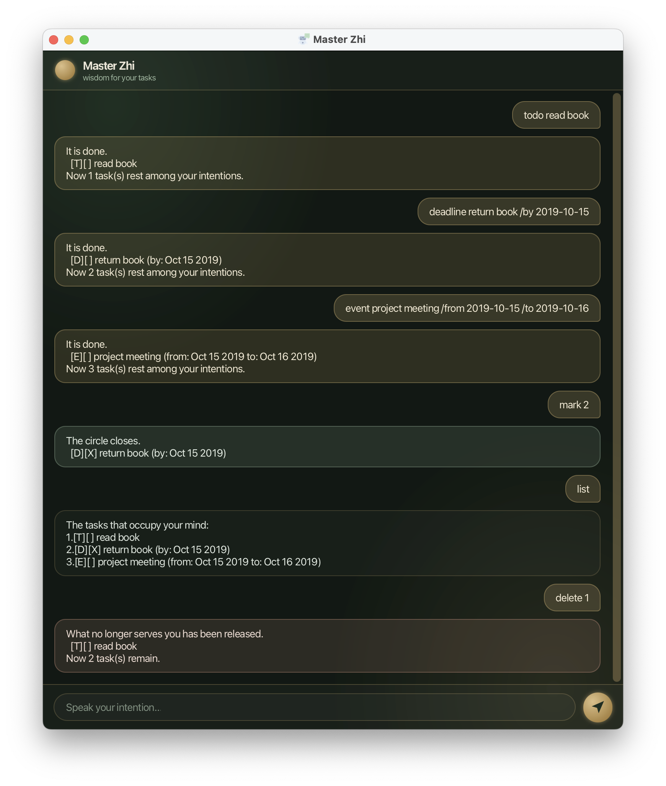

# XiaoZhi User Guide

XiaoZhi is a desktop chatbot that helps you track **todos, deadlines and events** by typing simple commands. It speaks in the voice of a mystic task-master ("Master Zhi"), but under the hood it's a fast, no-fuss task list: if you can type, XiaoZhi can manage your tasks faster than any mouse-driven app.



## Quick start

1. Ensure you have **Java 25** installed on your computer.
2. Download the latest `xiaozhi.jar` from [the Releases page](https://github.com/Lim-04/ip/releases).
3. Copy the file to the folder you want to use as the *home folder* for XiaoZhi. Your tasks will be saved in a `data` folder created inside it.
4. Open a terminal in that folder and run:
   ```
   java -jar xiaozhi.jar
   ```
   A window titled "Master Zhi" should appear in a few seconds.
5. Type a command in the text box at the bottom and press Enter (or click the send button) to try it out. A few examples:
   * `list` : lists all tasks.
   * `todo read book` : adds a todo named `read book`.
   * `deadline return book /by 2019-10-15` : adds a deadline due 15 Oct 2019.
   * `delete 3` : deletes the 3rd task shown in the current list.
   * `undo` : reverses your last action.
   * `bye` : exits the app.
6. Refer to the [Features](#features) below for details of each command.

## Features

**Notes about the command format:**
* Words in `UPPER_CASE` are parameters you supply, e.g. in `todo DESCRIPTION`, `DESCRIPTION` is a parameter, as in `todo read book`.
* Extra spaces between the command word and the rest of your input are ignored, so `todo   read book` works the same as `todo read book`.
* `INDEX` always refers to the number shown next to a task in the **most recently displayed `list`**. It is 1-based (the first task is `1`).
* Dates are typed as `yyyy-mm-dd` (e.g. `2019-10-15`) and are shown back to you as `MMM dd yyyy` (e.g. `Oct 15 2019`).
* A task's description cannot contain the `|` character, since it is used internally to save your data.

### Adding a todo: `todo`

Adds a todo (a task with no date attached) to your list.

Format: `todo DESCRIPTION`

Example: `todo read book`
```
It is done.
  [T][ ] read book
Now 1 task(s) rest among your intentions.
```

### Adding a deadline: `deadline`

Adds a task that must be done by a specific date.

Format: `deadline DESCRIPTION /by DATE`

Example: `deadline return book /by 2019-10-15`
```
It is done.
  [D][ ] return book (by: Oct 15 2019)
Now 2 task(s) rest among your intentions.
```

### Adding an event: `event`

Adds a task that spans from one date to another. The `/from` date cannot be later than the `/to` date.

Format: `event DESCRIPTION /from START_DATE /to END_DATE`

Example: `event project meeting /from 2019-10-15 /to 2019-10-16`
```
It is done.
  [E][ ] project meeting (from: Oct 15 2019 to: Oct 16 2019)
Now 3 task(s) rest among your intentions.
```

### Listing all tasks: `list`

Shows every task currently in your list, numbered from 1. Use this whenever you need the current `INDEX` numbers for `mark`, `unmark` or `delete`.

Format: `list`

### Finding tasks: `find`

Finds tasks whose description contains the given keyword. The match is case-sensitive and only looks at descriptions (not dates).

Format: `find KEYWORD`

Example: `find book`
```
These are the tasks that echo your search:
1.[T][ ] read book
```
Note: the numbers shown here are just for reading the results — run `list` first if you need the real `INDEX` to `mark`, `unmark` or `delete` one of the matches.

### Marking a task as done: `mark`

Marks the task at the given index as done.

Format: `mark INDEX`

Example: `mark 1`
```
The circle closes.
  [T][X] read book
```

### Unmarking a task: `unmark`

Marks the task at the given index as not done.

Format: `unmark INDEX`

Example: `unmark 1`
```
What was closed is opened again.
  [T][ ] read book
```

### Deleting a task: `delete`

Removes the task at the given index from your list.

Format: `delete INDEX`

Example: `delete 1`
```
What no longer serves you has been released.
  [T][ ] read book
Now 2 task(s) remain.
```

### Undoing your last action: `undo`

Reverses the most recent `todo`, `deadline`, `event`, `mark`, `unmark` or `delete`. You can call `undo` repeatedly to step back through several actions in a row, one at a time. There is no "redo".

Format: `undo`

### Exiting the program: `bye`

Says farewell and closes the app shortly after.

Format: `bye`

### Saving your data

Your tasks are saved automatically to disk after every command that changes them (adding, deleting, marking, unmarking, or undoing any of these) — there is no need to save manually.

### Editing the data file

Task data is saved as a text file at `[JAR folder]/data/xiaozhi.txt`. Advanced users may edit this file directly.

> **Warning:** If your changes to the data file make its format invalid, or a saved date/value falls outside its acceptable range, XiaoZhi may not start up correctly, or subsequent behaviour may not be as expected. Only edit the data file if you are confident you can keep it well-formatted. It's a good idea to back up the file before editing it.

## FAQ

**Q**: How do I transfer my data to another computer?
**A**: Install XiaoZhi on the other computer, then copy over the `data/xiaozhi.txt` file created by your old installation and place it in the same location on the new one.

**Q**: What happens if I type a command wrongly?
**A**: XiaoZhi will tell you what's wrong (in its own dramatic way) and leave your task list untouched, so you can just try again.

## Command summary

| Action | Format | Example |
|---|---|---|
| Todo | `todo DESCRIPTION` | `todo read book` |
| Deadline | `deadline DESCRIPTION /by DATE` | `deadline return book /by 2019-10-15` |
| Event | `event DESCRIPTION /from START /to END` | `event meeting /from 2019-10-15 /to 2019-10-16` |
| List | `list` | `list` |
| Find | `find KEYWORD` | `find book` |
| Mark | `mark INDEX` | `mark 1` |
| Unmark | `unmark INDEX` | `unmark 1` |
| Delete | `delete INDEX` | `delete 1` |
| Undo | `undo` | `undo` |
| Exit | `bye` | `bye` |
